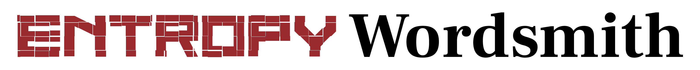

Entropy Wordsmith is a passphrase/natural language password generator inspired by Diceware but much more complex and grandiloquent, powered by WordNet.

# Mission Statement
Everyone knows secure passwords are important. And if you ever wondered about the strength of your password you have probably encountered [the famous XKCD comic](https://imgs.xkcd.com/comics/password_strength_2x.png) about the lack of entropy in "traditional" password construction in comparison to multi-word passphrases.  
A leading tool for this approach is [Diceware](https://diceware.dmuth.org), where a number words are randomly selected from a list based rolls of physical or digital dice.

There's nothing *wrong* Diceware, it's cool and secure. But what if you could make passphrases that are more complex and more *entertaining*, natural language passwords that utilize the entirety of the English language?

That is **Entropy Wordsmith** and it's ridiculous and over-the-top by design. It uses the [WordNet 3.1](https://wordnet.princeton.edu) database as a dictionary. After pruning everything shorter than 3 letters we end up with:

**117761 Nouns.  
21461 Adjectives.  
11549 Verbs.  
4481 Adverbs.**

As a general database of english this dataset includes not just common words but lots of proper nouns like locations or famous people, a whole bunch of niche academic terms most people haven't heard of, archaic and loan words etc.  
...Not to mention many of these words are already multi-word constructs. The resulting passphrases are huge, and therefore [very secure](#the-scale-and-the-math) and as a bonus they tend to be *completely nuts*.

Let's demonstrate with a few example generations:

```
Descendent: some anagoges jejunely unfrock a rockfoil.
A rhododendron chauffeurs the prefatorial beingnesses longways.
Overbearingly, the rainiest plain wanderers apostatise the palaeencephalon.
A macrocosmic Serpentes entrapped glossalgia hard.
Some pepper sprays fretfully divide the araneidan high comedies.
A wild yam propitiously lets down a clinking safety catch.
Curiously, the homeric business firms rationalise a drug war.
The stomacher, as such, radioes vase-shaped fire control radars.
A spiritless indirect object repulses the keg in person.
Blue-gray: an uncovering slap-bang acted as spike suppressor.
```
I bet you couldn't have come up with these.  
Where other passphrase methods aim for memorability using simple and common words, *Entropy Wordsmith* goes for the opposite effect: Phrases that gain memorability by using bizarre words in unhinged combinations.

Does this approach sacrifice simplicity to such an extend that it, somewhat self-defeatingly, comes full circle to generating pretty hard to remember passwords? Yes it does. Personally I use the generated phrases with a password manager. But when you're generating something complex and obscure anyway why not go for something that is also *stylish*?
# Usage
*Entropy Wordsmith* is a command line utility.  
You can either download end execute the windows executable or directly run **entropy_wordsmith.py** with Python 3.10+ (there are no dependencies, random numbers are generated with the secrets module).


```
entropy_wordsmith [count] [-i] [-n number] [-s start] [-l number] [-m 1|2|3||5] [-e string] [-a always|never|random] [-c always|never|random] [-u] [-p path] [-v] [-h]
```
Calling *Entropy Wordsmith* without any arguments will generate a list of 20 random passphrases:
```
$ entropy_wordsmith
```
Here, we generate 15 passphrases with their first word starting with "b" and appended with an exclamation mark instead of a period.
```
$ entropy_wordsmith 15 --start B --ending !
```
## Options

### positional arguments:
* **`count`** = The number of passphrases to generate. Defaults to 20.

### options:
* **`-i,--include_number`** = If the password is required to contain a number, this setting will force one of the nouns to be pluralized and prepend a random number in the range of 2-9, making the passphrase [stronger](#entropy-with-the--i--include_number-flag). 

* **`-n,--set_number`** = Same as the-i/--include-number argument, but directly specifies the number to use.
* **`-s,--start`** = Specify a letter that the first word of the passphrase needs to start with (not counting articles). Naturally this decreases the number of possible combinations.
* **`-l,--max_length`** = The maximum number of characters the passphrase should contain. Shorter settings give less varied results and are naturally weaker. ****
* **`-m,--mode`** = There are 5 word combination modes used to generate passphrases. They are normally chosen at random, but with this option you can specify a single one for the whole batch. Accepts a number in the range 1-5.
* **`-e,--ending`** = Select which characters should be appended at the end of the passphrase. Defaults to a period.
* **`-a,--articles`** = When to prepend nouns with articles: `always`, `never` or `random` *(50% chance, default value)*.
* **`-c,--comparatives`** = When to include comparative and superlative forms for adjectives: `always`, `never` or `random` *(default)*.
* **`-u,--underscore`** = Replace the spaces in the passphrase with underscores.
* **`-p,--path`** = A path of an output file. Leave blank to write the results to stdout.
* **`-v,--version`** = show program's version number and exit
* **`-h,--help`** = show a help message and exit


## Trigger Warning
The WordNet database contains obscenities, religious and politically charged terms and generally offensive words as a natural side effect of indexing the entire English language.  

Be prepared to encounter the occasional *spicy* password.

# The Scale and the Math
If we simply chose a random word from each list in a static order we'd get $117761 * 21461 * 11549 * 4481 = 130788863137119649$ possible combinations or 56.9 bits of entropy

But of course we're not done here, standard output produces something much stronger, let's break it down:

- Each passphrase uses two nouns, one verb one adverb and one adjective.
- There are 5 different variants in which those words can be arranged, changing both word placement and punctuation between them.
- Each of the nouns has a random 50% chance to be pluralized. This also effects the conjugation of the following verb but since those two are deterministically linked, the conjugation does not increase entropy.
- Each of the nouns *also* has a 2/3 chance to be prepended with one of two random articles, or with no article.
- The verb may be inflected in either the present (-es) or past (-ed) form, or not inflected but, as mentioned before, only in the (50%) case that the preceding noun is not pluralized.
- The Adjective has a 2/3 chance to be either in the comparative or superlative form, but only for the 1327 adjectives with actually different comparatives. All other adjectives roll another 1/3 chance to be prepended with either "more" or "most".

In terms of combinations that gives us in total:

$( (117761 * 2 * 3)^2 * (21461 * 3) * (11549 * \frac 3 2 ) * 4481 ) *5 = 12475480122631181058570090$  

That's **83** bits of entropy $^1$ , which is already much better and remember *this assumes the attacker already knows that you used this exact method with this exact dictionary*. $^2$

$^1$ Technically there's more going on than just shannon entropy, as the distribution of the modification of adjectives isn't actually uniform, but we're at least within that order of magnitude.  
$^2$ Otherwise, we're talking about more than **200** bits on average, as passphrases tend to be 50+ characters with punctuation.

### Entropy with the `-i/--include_number` flag
Using the `--include_number` option means that instead of being randomly pluralized, one of the nouns will always be pluralized and prepended with a random number between 2 and 9 inclusive.  
Now the number of possible combinations is:  
$( (117761 * 2 * 3) * (117761 * 8 * 3) * (21461 *3) * (11549 * \frac 3 2 ) * 4481 ) *5 = 49901920490524724234280360$  
...which amounts to 85 bits of entropy, 2 more than the standard setting.


# Limitations
Natural language is irregular and complex and WordNet only offers limited information for grammatical constructions. So especially with complex verbs and adverbials, there can be the occasional janky and grammatically incorrect output.  
I am basically rolling my own little lemmatization engine here, it's not perfect but it's getting better.

Generating passphrases of under 42 characters, *will* cause instability, and will also of course severely limit the strength of the resulting phrases.

# Roadmap
- There's always some some grammar edge cases that could be handled better.
- Thinking about migrating the word database to the more up-to-date *Open English Wordnet*
- Might try my hand at creating a GUI, we'll see.
